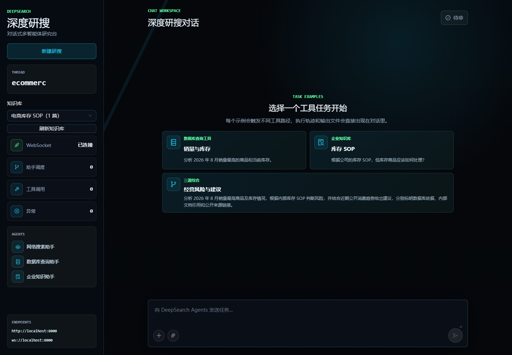
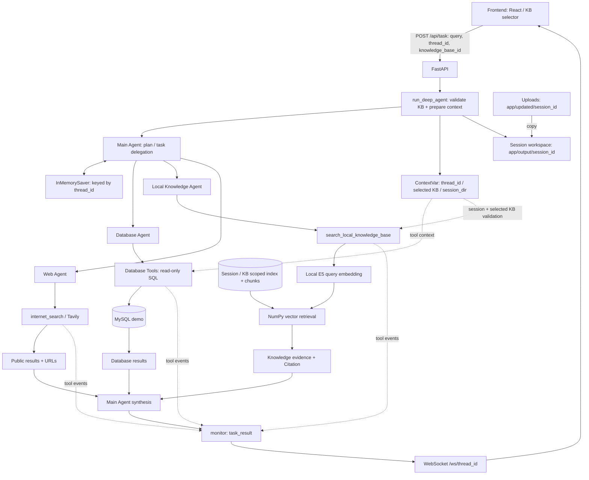

# DeepSearch Agents · 多源企业分析助手

面向企业数据分析场景的多源 AI Agent 原型。用户用自然语言提出业务问题，Main Agent 自主规划任务，按需委派数据库、私有知识和网络搜索助手，再依据多源证据生成综合回答。

**当前状态：功能冻结，本地单进程 Demo。**

**Core integration capabilities validated** — **final synthesis reliability not fully validated**。
离线回归 **608/608 PASS**；三次真实端到端验收整体均为 **FAIL**。工具执行成功与最终综合回答可靠性分别验收。



*已有真实验收开始前的页面截图：已选“电商库存 SOP”，尚未提交任务。不是成功回答的截图。*

## 核心能力

- Main Agent 自主规划、Sub-Agent 路由与必要补查，不预设三源调用顺序。
- MySQL 自然语言分析：发现表、检查结构与样例、执行只读 SQL；Demo 使用专用只读账号。
- Local RAG：文档加载、分块、本地 embedding、向量检索，返回带文档与片段位置的 Citation。
- Tavily 网络搜索，保留公开来源 URL；公开趋势仅作为背景。
- 多源证据综合：区分数据库事实、内部规则、公开背景和分析推断；模型遵循仍有边界。
- FastAPI + WebSocket 实时事件：助手/工具调用、结果、错误与取消。事件推送不等于逐 token 展示。
- `thread_id` 会话隔离、Knowledge Base 选择、会话内附件及文件产物。
- Prompt contract tests 与真实 LLM acceptance testing，分别验证实现约束与模型行为。

## 技术栈

| 层 | 当前实现 |
| --- | --- |
| 后端 | Python 3.12、FastAPI、Uvicorn |
| Agent | Deep Agents 0.5.7、LangChain、LangGraph、InMemorySaver |
| LLM | OpenAI 兼容协议；真实验收使用 DeepSeek `deepseek-flash` |
| 数据库 | MySQL 8.4、mysql-connector-python、Docker Compose |
| 本地知识库 | sentence-transformers、CPU PyTorch、multilingual-e5-small、NumPy 向量索引 |
| Web | Tavily |
| 前端 | React 19、TypeScript、Vite、Ant Design、Tailwind CSS |
| 文件与依赖 | pypdf、python-docx、pandas、ReportLab；uv、pnpm |

依赖以 [pyproject.toml](pyproject.toml)、[uv.lock](uv.lock)、[frontend/package.json](frontend/package.json) 为准。保留的 RAGFlow 教学代码与依赖未注册到当前 Main，电商 Demo 无需 RAGFlow 服务。

## Architecture



图中 `session_id` 是运行入口对 `thread_id` 的参数命名，实际目录为 `session_{thread_id}`。索引在 KB preparation 阶段建立。入口、上下文传递与存储详见 [Architecture](docs/architecture.md)。Main 还注册附件读取、Markdown/PDF 生成工具，不是本次三源验收重点。

## Demo Scenario

> 分析 2026 年 8 月销量最高的商品及当前库存情况，依据公司的库存 SOP 判断缺货风险；再检索近期公开的美妆消费趋势作为背景，给出简短建议，并分别标明数据库依据、内部文档引用和公开来源链接。

Database 查询销量与库存，Knowledge 检索企业 SOP，Web 查询公开趋势；Main 自主决定委派和补查。第三轮中，Main 补查了 SOP 所需的 **2026-08-02～08-31** 有效销量。

合成数据中两件商品整月销量均为 720 件，精确 30 天销量分别为 684、696 件，跨仓库存各 20 件，覆盖约 0.88、0.86 天。库存为 **2026-09-01 快照**，不代表运行当天库存。这些数值仅用于说明和验收，未写入 Main Prompt 作为固定答案。

数据、SOP、启动与证据索引：[电商 Demo](demo/ecommerce/README.md)。

## Quick Start

以下为仓库根目录下的 PowerShell 命令。需要 Python 3.12、uv、Docker Compose、满足 Vite 7 要求的 Node.js、pnpm 10.33.0 和自己的 API 凭据。

### 1. Python 与配置

```powershell
uv sync --frozen
Copy-Item .env.example .env
```

在本地 `.env` 中设置以下字段，占位符需替换；不要提交 `.env`：

```dotenv
OPENAI_BASE_URL=https://api.deepseek.com
OPENAI_API_KEY=<your-deepseek-key>
LLM_QWEN_MAX=deepseek-flash
TAVILY_API_KEY=<your-tavily-key>
MYSQL_HOST=localhost
MYSQL_PORT=3307
MYSQL_PASSWORD=<your-local-mysql-admin-password>
MYSQL_DATABASE=deepsearch_db
```

`LLM_QWEN_MAX` 是现有模型配置变量名。`.env.example` 保留通用教学默认值，按上文覆盖即可；Local RAG 不需要 RAGFlow 凭据。

### 2. MySQL 与电商数据（首次安装）

```powershell
docker compose --env-file .env -f docker/docker-compose.yaml up -d
docker compose --env-file .env -f docker/docker-compose.yaml ps
# 等待 healthy；输入与本地 MySQL 一致的管理密码，不将其写入命令历史
$demoSecret = Read-Host 'Local MySQL admin password' -AsSecureString
$env:ECOMMERCE_ADMIN_PASSWORD = [System.Net.NetworkCredential]::new('', $demoSecret).Password
try { uv run python scripts/seed_ecommerce_demo.py --apply }
finally { Remove-Item Env:ECOMMERCE_ADMIN_PASSWORD }
uv run python scripts/start_ecommerce_demo.py --init-config
uv run python scripts/start_ecommerce_demo.py --check
```

Compose 首次初始化原教学库；seed 脚本另建 `insight_ecommerce_db` 与 `ecommerce_ro`。脚本只连接 localhost:3307，拒绝覆盖已有电商库/账号。已有 Demo 跳过 seed，不重置数据卷；已有卷的密码不会随 `.env` 自动变化。

只读凭据与 Demo profile 位于被忽略的 `.data/ecommerce/`；启动脚本仅覆盖进程内数据库配置，不改 `.env`，Agent 不使用管理账号。

### 3. 本地 embedding 与 Demo KB

首次安装显式下载固定模型快照，不调用 LLM；已有模型则跳过下载。

```powershell
uv run python -c "from huggingface_hub import snapshot_download; from app.local_rag.config import EmbeddingConfig, EMBEDDING_MODEL_NAME, EMBEDDING_MODEL_REVISION; snapshot_download(repo_id=EMBEDDING_MODEL_NAME, revision=EMBEDDING_MODEL_REVISION, local_dir=str(EmbeddingConfig().model_dir))"
uv run python -X utf8 scripts/prepare_ecommerce_demo_kb.py
```

固定 revision 为 `614241f622f53c4eeff9890bdc4f31cfecc418b3`，运行时仅加载本地文件。准备脚本用库存 SOP 建立新会话的 KB，输出 `thread_id`、`knowledge_base_id` 和页面链接。

### 4. 后端与前端

```powershell
uv run python scripts/start_ecommerce_demo.py
# 另一个终端
cd frontend
pnpm install --frozen-lockfile
pnpm dev
```

后端为 `127.0.0.1:8000`，前端为 `localhost:5173`。打开准备脚本输出的链接，确认选择器为“电商库存 SOP”。普通上传仅保存附件；新建研搜切换 session 后需要重新准备 KB。提交任务产生真实 API 费用；冻结阶段无需再次提交。

## Tests

冻结前最后一次全量离线回归：**608/608 PASS**，DeepSeek / Tavily / 外部 HTTP 均为 0，见 [离线报告](demo/ecommerce/main_fact_fidelity_offline_results.json)。四项字段保真测试是静态 Prompt 契约检查，不代表模型一定遵循。

```powershell
uv run python -B -m unittest discover -s tests -p "test*.py"
```

覆盖 tools、文件边界、Local RAG 加载/分块/embedding 适配/向量检索/Citation、数据库语义、Main synthesis contracts、KB 选择和 API 上下文传递。离线用例使用替身隔离服务；真实 embedding 与浏览器显示由此前单独验收提供证据。608 项不是 608 项浏览器测试。

上述命令发现根层离线用例；`tests/integration/` 真实服务测试采用显式开关，冻结阶段不要开启。已记录的 608 项回归另外使用本地网络阻断观察入口，报告保留网络审计结果。前端编译可在 `frontend/` 执行 `pnpm build`。

## Real LLM Acceptance Testing

真实 **DeepSeek + MySQL + Local RAG + Tavily + 浏览器** 验证了 autonomous routing、precise database re-query、citation propagation、evidence source separation 和 frontend integration。

| 轮次 | 整体验收 | 主要问题 | 证据 |
| --- | --- | --- | --- |
| 1 | FAIL | 整月数据近似 SOP 窗口；无依据类目/趋势映射 | [原始记录](demo/ecommerce/main_agent_demo_integration_results.json) |
| 2 | FAIL | 精确窗口修复，但将“个护”写成“护肤类” | [Clean Retest 2](demo/ecommerce/main_agent_demo_clean_retest_2.json) |
| 3 | FAIL | 分类保真通过；无分仓销量却断言单仓覆盖不足 0.5 天 | [Clean Retest 3](demo/ecommerce/main_agent_demo_clean_retest_3.json) |

第三轮跨仓计算、公开背景边界、Citation/URL 和页面显示通过，但额外单仓指标缺少证据。因此 **tool-grounded execution** 与 **LLM synthesis reliability** 分开评估：核心集成能力已验证，最终综合可靠性尚未完全验证。没有第四轮修复，没有将 FAIL 改成 PASS。

第三轮：23 次 DeepSeek、4 次 Tavily、37 次工具调用、320,150 tokens。三个独立真实会话不构成统计意义上的可靠性保证。

## Known Limitations

1. `InMemorySaver` 重启后不保留聊天 checkpoint；磁盘 KB/索引与会话文件是另一类状态。
2. 面向本地单进程 Demo，不是多节点生产部署；session 隔离不等于生产用户认证。
3. 当前数据无跨月付款样本，跨月 `paid_at` 尚未真实 LLM 验证；保留 `blocked_preflight`，属于数据覆盖缺口。
4. 最终 synthesis 仍可能生成缺少工具证据支持的派生指标，需要业务复核。
5. 公开 Web 只能作为背景，不能自动解释内部业务变化或覆盖内部分类。

这些是 Demo / Prototype 的工程边界。三源执行链路可以演示，不宣称生产级完全可靠。

## Repository & Freeze

`app/` 为运行代码，`frontend/` 为界面，`scripts/` 为 Demo 准备与验证，`tests/` 为测试，`demo/ecommerce/` 保留说明、SOP 与验收历史，`docker/` 为 MySQL 配置。提交建议和截图来源见 [Project Freeze](docs/project-freeze.md)。密钥、缓存、临时观察脚本和会话产物不提交。

## 项目来源

本项目在原有 DeepAgents 教学工程基础上演进，保留来源：[didilili/deepsearch-agents](https://github.com/didilili/deepsearch-agents)。当前文档描述本工作区 Local RAG、电商 Demo 与验收状态，不能将原教学代码全部归为新增个人实现。
